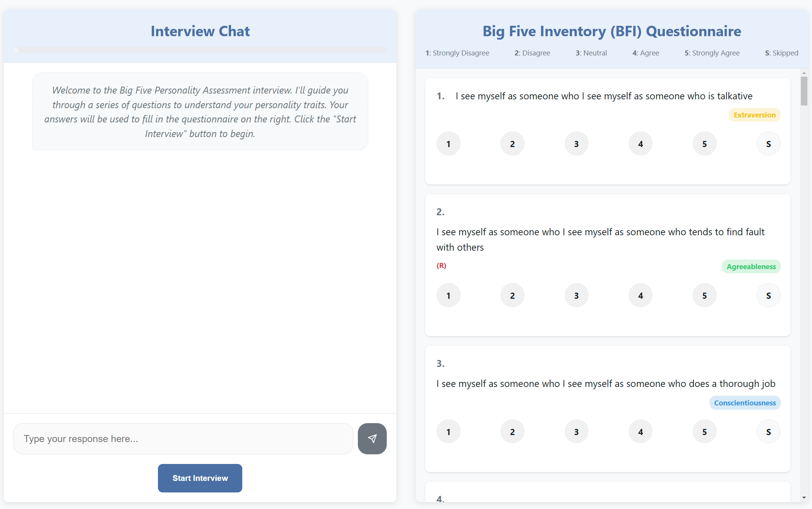

   # BFITraitTalk_AI 💬🧠

**A Conversational Big Five Personality Assessment Tool using Gemma 3**

This Flask-based web application allows users to complete the Big Five Inventory (BFI) personality assessment through an interactive, conversational interface powered by Google's Gemma 3 large language model, running locally for privacy.

[](https://opensource.org/licenses/Apache-2.0)



## Overview

Instead of a traditional checkbox form, BFITraitTalk_AI uses a chat interface where users discuss their agreement with BFI statements. The AI ("Kaya"):

* Asks questions based on the BFI sequence.
* Engages in basic conversation (e.g., clarifying questions).
* Interprets free-text responses to suggest a score (1-5 or skipped).
* Asks for confirmation before recording the score.
* Updates the questionnaire form visually in real-time.
* Generates a comprehensive personality profile upon completion.

The primary goal is to explore conversational AI for assessments while ensuring user data remains local.

## Technical Stack

* **Backend**: Flask (Python)
* **Frontend**: HTML, CSS, Vanilla JavaScript
* **LLM**: Google Gemma 3 (Instruction-Tuned variants: 4B, 12B, or 27B)
* **Core Libraries**: Transformers, PyTorch, Accelerate, BitsAndBytes (for quantization)

## Installation

### Prerequisites

* **Python**: 3.9+ recommended (tested with 3.10)
* **Git**: For cloning the repository.
* **GPU**: An NVIDIA GPU with CUDA support is **highly recommended** for reasonable performance. Check the [Hardware Requirements](#hardware-requirements) below. CPU execution is possible but very slow.
* **CUDA Toolkit & Drivers**: Ensure appropriate NVIDIA drivers and CUDA toolkit compatible with your PyTorch version are installed if using GPU.

### Step 1: Clone the Repository

```bash
# Replace with your actual repo URL if different
git clone git@github.com:treese41528/BFITraitTalk_AI.git
cd BFITraitTalk_AI
```

### Step 2: Create and Activate Virtual Environment

It's strongly recommended to use a virtual environment to manage dependencies.

```bash
# Create the environment (use python3 or python depending on your system)
python -m venv venv

# Activate the environment:
# Linux/macOS
source venv/bin/activate
# Windows (Git Bash/WSL)
source venv/Scripts/activate
# Windows (Command Prompt/PowerShell)
.\venv\Scripts\activate
```

(You should see (venv) at the start of your terminal prompt)

### Step 3: Install Dependencies

```bash
# Upgrade pip (optional but good practice)
pip install --upgrade pip
# Install required packages
pip install -r requirements.txt
```

### Step 4: Download Gemma 3 Model Files

The large language models are not included in the repository. You need to download the desired Gemma 3 instruction-tuned model (e.g., gemma-3-4b-it).

#### Method 1: Using the included downloader script (Recommended)

This script uses the huggingface_hub library to download and place the model correctly. You might need to log in to Hugging Face Hub (huggingface-cli login).

Run the script from the project root directory. Choose the size you need:

```bash
# Example: Download the 12B instruction-tuned model
python utils/gemma_downloader.py --model_size 12b --variant it

# Example: Download the 4B instruction-tuned model
# python utils/gemma_downloader.py --model_size 4b --variant it
```

This will download the model into the data/hf_models/gemma-3-{size}-it/ directory. Note: These models are large (several GB) and may take time to download.

#### Method 2: Manual Download

Manually download the snapshot of the desired instruction-tuned model (e.g., google/gemma-3-4b-it) from the Hugging Face Hub.

Ensure the downloaded files are placed within the correct subdirectory structure inside the data/hf_models/ folder:

```
BFITraitTalk_AI/
└── data/
    └── hf_models/
        └── gemma-3-4b-it/    # Contains all files for the 4B IT model
        └── gemma-3-12b-it/   # Contains all files for the 12B IT model
        └── ...
```

### Step 5: Configure the Application

Review and potentially edit config.py to match your downloaded model and hardware capabilities. Key settings:

```python
# Select the model size you downloaded (e.g., "4b", "12b")
MODEL_SIZE = "12b"

# Choose quantization ('4bit', '8bit', 'none') based on VRAM
# '4bit' uses least memory, 'none' uses most but has highest quality
QUANTIZATION = "4bit"

# Device: 'auto' usually works. Can force 'cuda' or 'cpu'.
DEVICE = "auto"

# Enable Flash Attention 2 if installed and supported (usually faster on compatible GPUs)
USE_FLASH_ATTENTION = True
```

You can also override these using environment variables (see Configuration Options), but editing config.py is often simpler for local runs.

## Running the Application

1. Make sure your virtual environment is activated (source venv/bin/activate or similar).

2. Run the Flask application from the project root directory:

```bash
python survey_app.py
```

3. Wait for the model to load (this can take some time, especially on the first run or with larger models). You'll see log messages in the terminal.

4. Once the server is running (it will typically say Running on http://127.0.0.1:5000 or similar), open your web browser and navigate to that address.

5. Click the "Start Interview" button.

## Usage

1. Engage in conversation with the AI interviewer ("Kaya") in the left chat panel.

2. Answer the personality statements presented by the AI in your own words or by providing a number (1-5).

3. The AI will interpret your response, propose a score, and ask for confirmation ("Does that feel right?").

4. Reply with "yes" or "no" to confirm or reject the proposed score. If you reject, the AI will ask for the correct score.

5. The BFI questionnaire form on the right panel will update in real-time as answers are confirmed.

6. If you ask for clarification (e.g., "What does that mean?", "Can you give examples?"), the AI should attempt to explain and then re-ask the current question.

7. Once all questions are answered, a personality profile based on the BFI dimensions will be displayed in the right panel.

## Configuration Options (Environment Variables)

You can override settings in config.py by setting environment variables before running python survey_app.py.

```bash
# Example for Linux/macOS:
export GEMMA_MODEL_SIZE="4b"
export GEMMA_QUANTIZATION="4bit"
export DEBUG_MODE="False"
export LOG_LEVEL="INFO"
python survey_app.py

# Example for Windows (Command Prompt):
set GEMMA_MODEL_SIZE=4b
set GEMMA_QUANTIZATION=4bit
set DEBUG_MODE=False
set LOG_LEVEL=INFO
python survey_app.py

# Example for Windows (PowerShell):
$env:GEMMA_MODEL_SIZE = "4b"
$env:GEMMA_QUANTIZATION = "4bit"
$env:DEBUG_MODE = "False"
$env:LOG_LEVEL = "INFO"
python survey_app.py
```

### Available Environment Variables:

* **GEMMA_MODEL_SIZE**: "4b", "12b", "27b"
* **GEMMA_QUANTIZATION**: "none", "4bit", "8bit"
* **GEMMA_DEVICE**: "auto", "cuda", "cpu"
* **USE_FLASH_ATTENTION**: "True" or "False"
* **FLASK_HOST**: Default "0.0.0.0"
* **FLASK_PORT**: Default 5000
* **DEBUG_MODE**: "True" or "False"
* **LOG_LEVEL**: "DEBUG", "INFO", "WARNING", "ERROR", "CRITICAL"
* **TEMPERATURE**, **TOP_P**, **MAX_NEW_TOKENS**: Control LLM generation parameters.

## Hardware Requirements (Approximate)

VRAM requirements depend heavily on quantization and model size. These are estimates:

| Model Size | Quantization | Min VRAM | Rec. VRAM | Notes |
|------------|--------------|----------|-----------|-------|
| 4B | 4-bit | ~3 GB | 5 GB+ | Good starting point |
| 4B | 8-bit | ~5 GB | 7 GB+ | |
| 4B | none (BF16) | ~9 GB | 11 GB+ | |
| 12B | 4-bit | ~7 GB | 10 GB+ | Good balance |
| 12B | 8-bit | ~13 GB | 16 GB+ | |
| 12B | none (BF16) | ~25 GB | 28 GB+ | Requires substantial VRAM |
| 27B | 4-bit | ~15 GB | 18 GB+ | High-end consumer GPUs |
| 27B | 8-bit | ~28 GB | 32 GB+ | Professional/Datacenter |
| 27B | none (BF16) | ~55 GB | 60 GB+ | Multiple/High-end GPUs |

* Running on CPU is possible (GEMMA_DEVICE=cpu) but will be very slow.
* Actual usage may vary based on sequence length and other factors.

## Troubleshooting

* **CUDA Out of Memory Error**:
  * Stop the app.
  * Edit config.py: Lower MODEL_SIZE (e.g., "12b" -> "4b"), use more quantization (QUANTIZATION="4bit"), or try both.
  * Restart the app: python survey_app.py.
  * Ensure no other processes are using significant GPU memory.

* **Model Loading Errors** (OSError, HTTPError during download):
  * Verify the model was downloaded correctly using the script or manually. Check the contents of the data/hf_models/gemma-3-{size}-it/ folder.
  * Ensure you have sufficient disk space.
  * Check file permissions in the data/ directory.
  * If using the downloader script, ensure you are logged into Hugging Face Hub (huggingface-cli login).
  * Check your internet connection if downloading.

* **Slow Responses**:
  * Use a smaller model size or more quantization (see OOM error steps).
  * Make sure GEMMA_DEVICE is set to cuda or auto if you have a compatible GPU. Check terminal logs for device placement information.
  * Install Flash Attention 2 (pip install flash-attn --no-build-isolation) if your GPU supports it (check NVIDIA Ampere, Ada Lovelace, Hopper architectures) and ensure USE_FLASH_ATTENTION = True in config.py.

* **Incorrect Behavior / AI Not Following Instructions**:
  * Check the terminal logs for errors or warnings from the application or the LLM handler.
  * Experiment with generation parameters (TEMPERATURE, TOP_P) in config.py, although the defaults should generally work.
  * Ensure the correct instruction-tuned model variant (-it) was downloaded.

* **Web Interface Issues**:
  * Clear your browser cache.
  * Check the browser's developer console (usually F12) for JavaScript errors.

## License

Copyright 2025 treese41528

Licensed under the Apache License, Version 2.0 (the "License");
you may not use this file except in compliance with the License.
You may obtain a copy of the License at

http://www.apache.org/licenses/LICENSE-2.0

Unless required by applicable law or agreed to in writing, software
distributed under the License is distributed on an "AS IS" BASIS,
WITHOUT WARRANTIES OR CONDITIONS OF ANY KIND, either express or implied.
See the License for the specific language governing permissions and
limitations under the License.

(Please also ensure a file named LICENSE exists in the repository root containing the full Apache License 2.0 text).

## Acknowledgments

* The Big Five Inventory (BFI) questionnaire items used are based on standard public versions.
* Powered by Google's Gemma 3 models.
* Built with Flask, Transformers, PyTorch, and other open-source libraries.
* This project is intended for educational and demonstration purposes only and is not a substitute for professional psychological assessment.